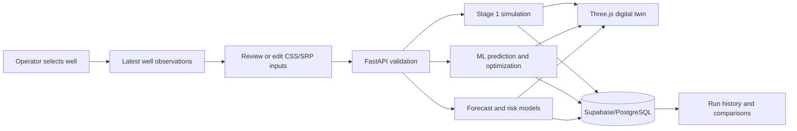

# Baghewala CSS/SRP Digital Twin

**Predict. Optimize. Recover.**

An AI-enabled well-to-surface digital twin for exploring Cyclic Steam Stimulation (CSS) and Sucker Rod Pump (SRP) operating decisions for heavy-oil wells in the Baghewala field context.

The application combines validated operator inputs, a simplified physics simulation, trained machine-learning models, numerical optimization, risk assessment, next-day forecasting, run history, and an animated Three.js representation of the well system.

> **Prototype disclaimer:** This is a synthetic-data hackathon prototype for decision support and demonstration. It is not calibrated or validated for direct field control, equipment safety decisions, or production operations.

## What the system does

- Selects one of the available BGH wells and loads its latest recorded operating state.
- Simulates reservoir, flow, pump, rod, and risk behavior from CSS/SRP inputs.
- Predicts production, steam-oil ratio (SOR), energy per barrel, and equipment-risk indicators.
- Optimizes controllable CSS and SRP parameters using trained models and numerical search.
- Forecasts next-day oil production from historical well observations.
- Presents current and recommended states through an interactive 3D digital twin.
- Stores simulations, optimizations, forecasts, and history in Supabase.
- Explains recommendations with deterministic, operator-friendly comparisons.

## System flow



## Technology stack

| Layer | Technologies |
|---|---|
| Frontend | React, TypeScript, Vite |
| 3D visualization | Three.js, GLB model authored/refined with Blender |
| Backend | Python, FastAPI, Pydantic, Uvicorn |
| AI/ML | XGBoost, scikit-learn, SciPy, Pandas, NumPy, Joblib |
| Database | Supabase, PostgreSQL |
| Deployment | Vercel (frontend and backend), Supabase (database) |
| Testing | Pytest, HTTPX, TypeScript/Vite production build |

## Project structure

```text
sih/
|-- frontend/                 React dashboard and Three.js digital twin
|   |-- public/models/        GLB well model
|   `-- src/                  Components, API client, types, and styles
|-- backend/                  FastAPI application
|   |-- app/routers/          API endpoints
|   |-- app/simulation/       Stage 1 physics approximation
|   |-- app/ml/               Optimization, forecast, and risk inference
|   |-- app/schemas/          Pydantic request/response models
|   |-- app/services/         Supabase access layer
|   |-- docs/                 API contract
|   |-- scripts/              Seed, import, and verification utilities
|   |-- supabase/migrations/  Database schema migrations
|   `-- tests/                Backend test suite
|-- ai_ml/                    Model-training resources and scripts
`-- DEPLOYMENT.md             Vercel deployment guide and Render alternative
```

## Prerequisites

- Python 3.11 or newer
- Node.js 20 or newer
- pnpm
- A Supabase project with the included migrations applied

Enable pnpm through Corepack if it is not already installed:

```powershell
corepack enable
corepack prepare pnpm@latest --activate
```

## Run locally on Windows

### 1. Configure and start the backend

Open PowerShell in the repository root:

```powershell
cd backend
python -m venv .venv
.venv\Scripts\python.exe -m pip install -r requirements.txt
Copy-Item .env.example .env
```

Edit `backend/.env` and supply your Supabase values:

```dotenv
SUPABASE_URL=https://your-project.supabase.co
SUPABASE_KEY=your-key
CORS_ORIGINS=http://localhost:5173,http://127.0.0.1:5173
```

Start FastAPI:

```powershell
.venv\Scripts\python.exe -m uvicorn app.main:app --host 127.0.0.1 --port 8000 --reload
```

Useful backend URLs:

- Health: <http://127.0.0.1:8000/health>
- Interactive API documentation: <http://127.0.0.1:8000/docs>

### 2. Configure and start the frontend

Open a second PowerShell window in the repository root:

```powershell
cd frontend
pnpm install --frozen-lockfile
Copy-Item .env.example .env
pnpm run dev
```

Open <http://localhost:5173>.

The local frontend uses `http://127.0.0.1:8000` during development. For other environments, set:

```dotenv
VITE_API_BASE_URL=https://your-backend.example.com
```

## API overview

| Method | Endpoint | Purpose |
|---|---|---|
| `GET` | `/health` | Lightweight service health check |
| `GET` | `/api/wells` | List available wells |
| `GET` | `/api/wells/{well_id}` | Get one well |
| `POST` | `/api/simulation` | Run the Stage 1 simulation |
| `POST` | `/api/optimization` | Generate optimized CSS/SRP recommendations |
| `POST` | `/api/forecast/next-day` | Forecast next-day oil production |
| `POST` | `/api/risk` | Assess history-based operating risks |
| `GET` | `/api/history/{well_id}` | Load simulation, optimization, and forecast history |

Well lookup endpoints accept either the Supabase well UUID or a well name such as `BGH-001`. Response `well_id` values are normalized to the resolved UUID. See [`backend/docs/API_CONTRACT.md`](backend/docs/API_CONTRACT.md) for request and response details.

## Database setup

1. Create a Supabase project.
2. Run the SQL migrations from `backend/supabase/migrations/` in order.
3. Set `SUPABASE_URL` and `SUPABASE_KEY` in `backend/.env`.
4. From `backend/`, seed/import the required data using the scripts in `backend/scripts/`.

The detailed SQL and setup notes are also available in [`backend/README.md`](backend/README.md).

Never commit `.env` files or real credentials. The raw dataset can remain excluded from Git; deployed inference uses the committed trained model artifacts.

## Verification

Run the backend tests:

```powershell
cd backend
.venv\Scripts\python.exe -m pytest
```

Run the backend integration verifier when Supabase is configured:

```powershell
.venv\Scripts\python.exe verify.py
```

Build the frontend:

```powershell
cd frontend
pnpm install --frozen-lockfile
pnpm run build
```

## Deployment

The intended deployment is:

- Frontend: Vercel
- Backend: Vercel FastAPI service (Render remains an alternative)
- Database: hosted Supabase/PostgreSQL

Import the repository root into Vercel to deploy both services with `vercel.json`. Follow [`DEPLOYMENT.md`](DEPLOYMENT.md) for environment variables, verification, and the alternative Render setup.

## Data and engineering limitations

- The Baghewala-style baseline is synthetic and must not be presented as confidential or measured field data.
- Stage 1 equations are visualization-oriented approximations, not a calibrated reservoir simulator.
- ML recommendations are model outputs over the synthetic operating envelope.
- Risk categories are dataset-relative indicators, not validated equipment safety limits.
- Recommendations require engineering review before any real operational use.

## Repository

GitHub: <https://github.com/PARTH-18-06/DIGITAL-TWIN-SYSTEM-.git>
